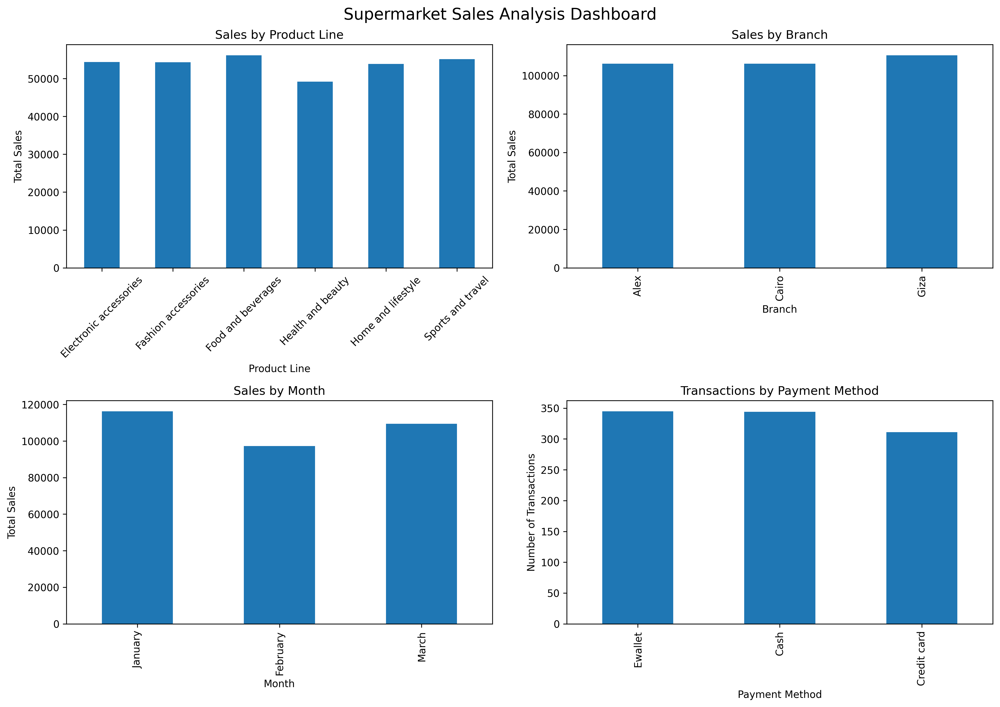

# Thiranex Virtual Internship – Task 1

## Data Cleaning & Visualization Project

This project was completed as part of the Thiranex Virtual Internship. The objective of this task was to perform data cleaning, preprocessing, exploratory analysis, and visualization on a supermarket sales dataset.

## Project Objective

The main objectives of this project are:

- Identify and handle missing values
- Detect duplicate records
- Check categorical data consistency
- Analyze numerical data
- Detect and investigate outliers
- Perform basic data preprocessing
- Analyze sales patterns
- Create meaningful visualizations
- Develop a dashboard to communicate key findings

## Dataset

The dataset contains **1,000 supermarket transactions** with information about:

- Branch
- City
- Customer type
- Gender
- Product line
- Unit price
- Quantity
- Tax
- Sales
- Date
- Time
- Payment method
- COGS
- Gross income
- Customer rating

## Tools & Technologies

- Python
- Pandas
- Matplotlib
- Google Colab
- Jupyter Notebook

## Data Cleaning & Preprocessing

The dataset was examined for missing values and duplicate records.

### Missing Values

No missing values were found.

**Missing values: 0**

### Duplicate Records

No duplicate rows were found.

**Duplicate rows: 0**

### Categorical Consistency

Categorical columns were checked for inconsistent values, spelling variations, and capitalization issues. No obvious inconsistencies were identified.

### Outlier Analysis

The Interquartile Range (IQR) method was used to identify potential numerical outliers.

Nine transactions were identified as potential high-value outliers in sales-related variables. These records were inspected and found to contain internally consistent values for unit price, quantity, tax, COGS, and sales.

Therefore, these observations were retained because they represented valid transactions rather than data-entry errors.

### Date Preprocessing

The `Date` column was converted from object format to datetime format, and a `Month` column was created for monthly sales analysis.

## Key Findings

- **Highest sales product line:** Food and beverages
- **Highest sales branch:** Giza
- **Highest sales month:** January
- **Most-used payment method:** Ewallet
- **Highest total sales customer type:** Member
- **Highest-rated product line:** Food and beverages

## Visualizations

The project includes visualizations for:

1. Total sales by product line
2. Total sales by branch
3. Total sales by month
4. Transactions by payment method
5. Total sales by customer type
6. Transactions by gender
7. Average rating by product line

## Dashboard

A combined dashboard was created to present the major findings in a single visual report.

## Project Files

| File | Description |
|---|---|
| `Thiranex_Task_1_Data_Cleaning.ipynb` | Complete Python analysis and visualization notebook |
| `SuperMarket Analysis.csv` | Original supermarket sales dataset |
| `cleaned_supermarket_sales.csv` | Cleaned and preprocessed dataset |
| `supermarket_sales_dashboard.png` | Final visualization dashboard |

## Final Result

The dataset was successfully cleaned, analyzed, and visualized. The final processed dataset contains **1,000 records and 18 columns**, with no missing values and no duplicate records.

The project demonstrates the complete workflow of data preprocessing, exploratory analysis, visualization, and data storytelling using Python.
